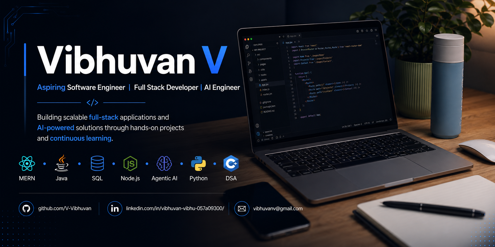

  

## About Me
## 👨‍💻 About Me

I'm **Vibhuvan V**, a final-year **Computer Science Engineering** student at **SASTRA University**, passionate about building scalable software and solving real-world problems through technology.

My primary interests lie in **Software Engineering**, **Full Stack Development**, and **Applied AI**. I enjoy designing end-to-end applications, exploring modern AI frameworks, and continuously improving my problem-solving skills through Data Structures & Algorithms.

I'm currently preparing for **Software Engineering internships and placements**, while building projects that combine robust backend engineering with intelligent AI-powered features.

---

## 🚀 Current Focus

- 💻 Building scalable Full Stack applications using the MERN stack
- 🤖 Developing AI-powered applications with Agentic AI and LLMs
- 🧩 Strengthening Data Structures & Algorithms for Software Engineering roles
- ☁️ Learning System Design and cloud-native application development
---

## 🛠️ Tech Stack

### 💻 Programming Languages

---

### 🎨 Frontend Development

---

### ⚙️ Backend Development

---

### 🗄️ Databases

---

### 🤖 AI & Generative AI

---

### 🛠️ Tools & Platforms

---

## 🚀 Featured Projects

<b>📈 TradeApp – AI-Powered Trading Platform</b>

 

A production-inspired **MERN trading platform** featuring real-time portfolio management, live market updates, AI-powered financial insights, and high-performance backend architecture.

### ✨ Highlights

- 📊 Real-time portfolio tracking using Socket.io
- 🤖 AI-powered trading copilot with LLMs & RAG
- 🔄 ACID-compliant MongoDB transactions
- ⚡ Backend optimized with Jest, k6 & GitHub Actions

### 🛠️ Tech Stack

`React` `Node.js` `Express` `MongoDB` `Socket.io`
`LLMs` `Agentic AI`

📂 **Repository**

👉 https://github.com/V-Vibhuvan/finance_clone

---

<b>🤖 Astra RAG – Containerized Agentic AI Platform</b>

 

An **offline-first Agentic AI platform** that enables intelligent document understanding through semantic retrieval and local LLM inference.

### ✨ Highlights

- 🐳 Dockerized MERN microservices architecture
- 🧠 LangGraph-powered Agentic AI workflows
- 📚 MongoDB Atlas Vector Search
- 🔒 Local Llama 3 inference using Ollama

### 🛠️ Tech Stack

`React` `Node.js` `MongoDB`
`LangGraph` `Docker` `Ollama`

📂 **Repository**

👉 https://github.com/V-Vibhuvan/Astra_RAG

---

<b>🎥 Connectly – WebRTC Meet & Chat Application</b>

 

A **real-time communication platform** supporting peer-to-peer video conferencing, messaging, and room management.

### ✨ Highlights

- 🎥 HD Video & Audio Calls
- 💬 Live Chat
- 🌐 WebRTC Peer-to-Peer Streaming
- ⚡ Low-latency Socket.io Signaling

### 🛠️ Tech Stack

`React` `Node.js` `Express`
`MongoDB` `WebRTC` `Socket.io`

📂 **Repository**

👉 https://github.com/V-Vibhuvan/connectly

---

<b>🚚 Logistics Management System</b>

 

A **Java-based logistics management application** implementing inventory tracking, shipment management, and optimized routing using JDBC and MySQL.

### ✨ Highlights

- 📦 Shipment & Inventory Management
- 🗄️ JDBC + MySQL Integration
- 📈 Route Optimization Algorithms
- 🧩 Object-Oriented Design

### 🛠️ Tech Stack

`Java` `JDBC` `MySQL`

📂 **Repository**

👉 https://github.com/V-Vibhuvan/Logistics_Management

---

## 📊 GitHub Analytics

    

---

## 🚀 Engineering Highlights

- 🚀 Built **6+ full-stack applications** ranging from real-time communication platforms to AI-powered software.
- 🤖 Developing intelligent applications using **Generative AI**, **Agentic AI**, **LLMs**, and modern AI frameworks.
- ⚙️ Designed scalable backend systems with **Node.js**, **Express.js**, **MongoDB**, **Socket.io**, and **Docker**.
- 🌐 Experienced in building end-to-end applications using the **MERN Stack** with responsive and user-centric interfaces.
- 🏗️ Passionate about writing clean, maintainable, and production-oriented software with a strong focus on backend architecture.
- 🎯 Actively preparing for **Software Engineering Internships & Full-Time Opportunities**.
---

### Let's Connect

<a href="https://github.com/V-Vibhuvan">GitHub</a> •
<a href="https://www.linkedin.com/in/vibhuvan-vibhu-057a09300/">LinkedIn</a> •
<a href="mailto:vibhuvanv@gmail.com">Email</a>

 

Open to collaborations, software engineering opportunities, and interesting conversations.

